# viannacloud.ir capcha solver

# Usage

**download 4 images and put them in `./lib/temp`**
*note:* 4 could be vary
```
app  download  4
```

**extract and organize numbers from images placed in `./lib/raw`** 
```
app  extract
```

**solve capcha locaed in `lib/raw/image-path.jpg`**
*note:* `lib/raw/image-path.jpg` could be vary
```
app  solve  lib/raw/image-path.jpg
```


# DEV guide
**install dependencies:**
```
nimble install
```

**test the with images placed in `lib/raw`**
```
nimble test
```

build using | produce executable file
```
nimble build
```


# How does this work?
the capcha imagees that are used in  [viannacloud.ir](viannacloud.ir), are:
1. same image size
2. the numbers have the same font familty & size
3. position of the numbers do not vary from image to image
4. all of the capchas are sum of a 2 digits number plus an one digit number ::  `ab + c =`

and this characteristics makes it so vulnerable to hack

### NOTE
> this repository is made only for educational purposes, and the owner does not take any responsibility about the users' usage, the purpose of the reader/user may differ


## steps
### finding the extact place of each number
because the font and the position of the numbers do not change, we can easily find them.

I've downloaded `80` capchas located in `/lib/raw/` 

[you can find them for yourself using another [software of mine](https://hamidb80.github.io/image-pixel-marker/). the guidence of this software exaplned [here](https://github.com/hamidb80/image-pixel-marker)]


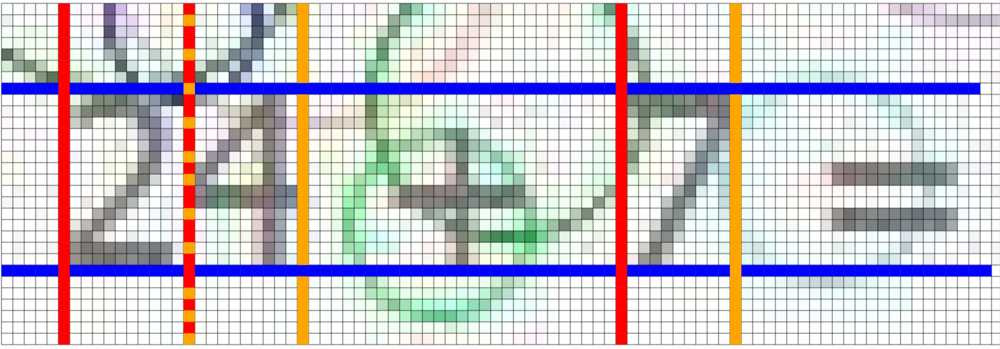
after examining some capchas, I found the exact position of each number

- **height**: each number starts from pixel 8 to 22 in Y-axis [the blue lines]
- **width**: they're all 9 pixels in width [the orange lines ]
- **x**: numbers start at these pixels in X-axis: 6, 17, 55

I crop them to examine them individually.

**note**: these cropped images are not in the repository, if you want them, you can use commands in DEV guide Section

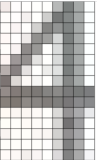
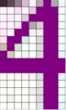

left: real picture
right: selected pixels [purple]

after examining some of `4`s that is placed in `lib/numbers/4` I figured out the must have pixels of number 4

i've exported the points using the software [that I put it's link earlier] and put them in `patterns/4.json`
and did the same for rest of the numbers...


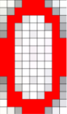
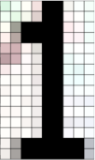
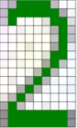
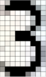

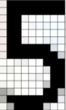
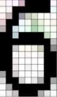
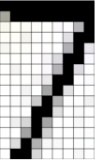
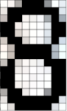
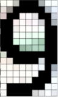


we're not done yet! there is one more thing to consider and that is very important

and that is *pattern matching order*

image you've got some chaos like this 
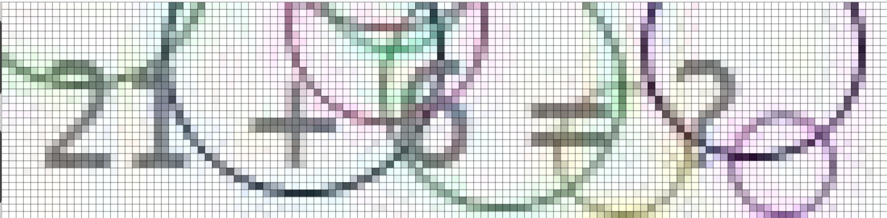

there might be an 8 that because of that stupid lines and curves, not matches only with 8 pattern, but also with 9 or 6 or 0!

so i defined a priority [8, 9, 6, 0, 3, 5, 2, 4, 7, 1] to ensure that numbers that are looked similar to other numbers with higher marked pixels, match first
